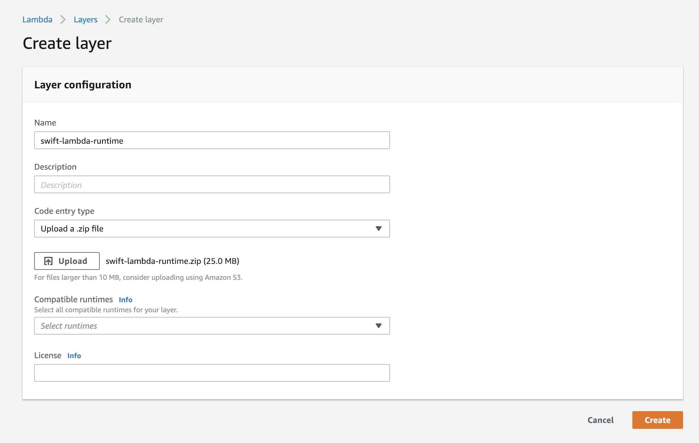
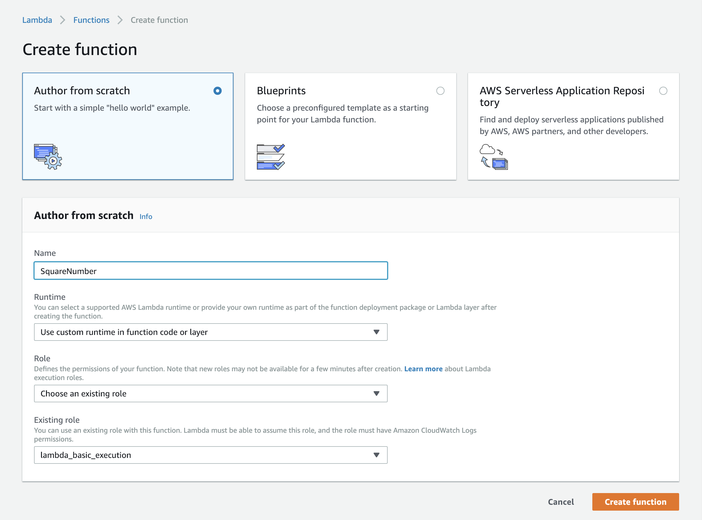

# aws-lambda-swift

The goal of this project is to implement a custom AWS Lambda Runtime for the Swift programming language.

### Step 1: Implement a lambda handler function
`ExampleLambda` is an SPM package with a single, executable target that implements the lambda handler function.
This package depends on the `AWSLambdaSwift` package which produces a library that contains the actual runtime.
In the main.swift file of the `ExampleLambda` executable we import the AWSLambdaSwift library, instantiate the
`Runtime` class and then register our handler function. Finally, we start the runtime:

```swift
import AWSLambdaSwift

func suareNumber(input: JSONDictionary) -> JSONDictionary {
    guard let number = input["number"] as? Double else {
        return ["success": false]
    }

    let squaredNumber = number * number
    return ["success": true, "result": squaredNumber]
}

let runtime = try Runtime()
runtime.registerLambda("squareNumber", handler: suareNumber)
try runtime.start()
```

At the moment, the handler functions need to have a single parameter of type `JSONDictionary` and they also need to
return a `JSONDictionary`. This type is just a typealias for the type `Dictionary<String, Any>`.

### Step 2: Build the lambda
AWS Lambdas run on Amazon Linux (see [https://docs.aws.amazon.com/lambda/latest/dg/current-supported-versions.html](https://docs.aws.amazon.com/lambda/latest/dg/current-supported-versions.html)).
This means that we can't just run `swift build` on macOS because that will produce a macOS executable which doesn't run on Linux. Instead, I have used Docker to build the `ExampleLambda` package.
Execute the following command to build the `ExampleLambda` package and bundle it in the `lambda.zip` file together with the `bootstrap` file.

```bash
make package_lambda
```

The `bootstrap` file is a simple shell script that launches the executable.

### Step 3: Build the layer
We now have a Linux executable. However, this executable dynamically links to the Swift standard library and a bunch of other shared libraries (Foundation, Grand Central Dispatch, Glibc, etc). Those
libraries are not available on Amazon Linux. Thus, I created an [AWS Lambda Layer](https://docs.aws.amazon.com/lambda/latest/dg/configuration-layers.html) which contains all of those shared libraries.
The AWS Lambda can then reference this layer. This makes sure that we only have to upload the libraries once instead of every time we want to update the lambda. Run the following command
to create a `swift-shared-libs.zip` file that contains the libraries for the layer:

```bash
make package_layer
```

### Step 4: Setup the layer on AWS
Create a new lambda layer in the AWS Management console using the `swift-shared-libs.zip` file:



This might take a few minutes. Once the upload is done, the layer's ARN (Amazon Resource Name) is shown on the page. In the next step we will use this ARN to reference the layer from the lambda.

### Step 5: Setup the lambda on AWS
First create a new lambda function in the AWS Management console and select "Use custom runtime in function code or layer":



Next, select the `lambda.zip` file as the function package to upload and set the handler to "ExampleHandler.squareNumber".


Finally, click the "Save" button in the upper right corner in order to save these changes.

### Step 6: Run the lambda